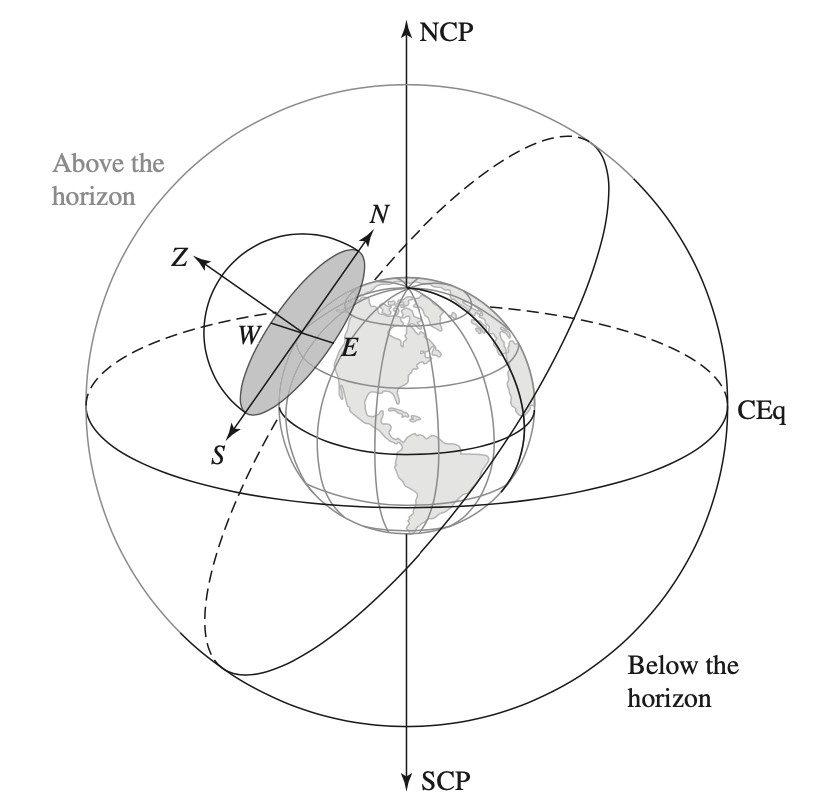
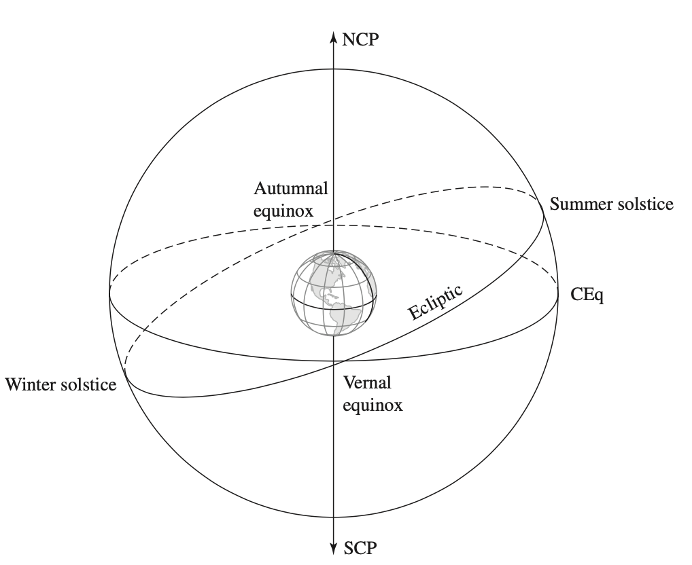
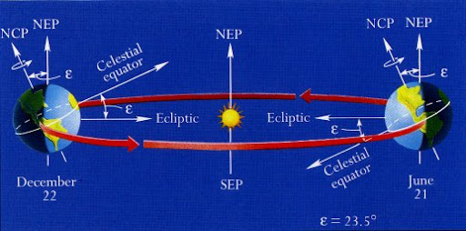
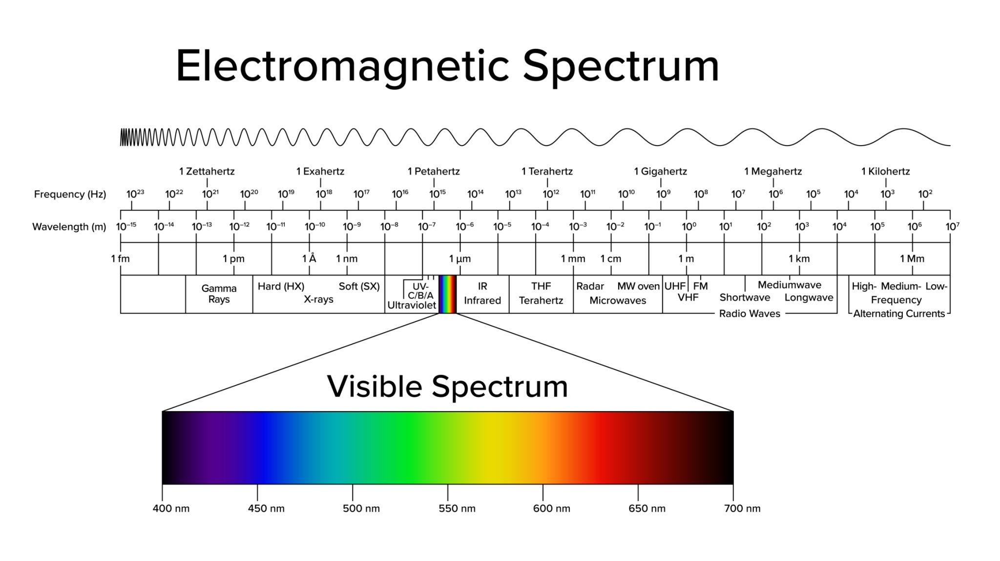
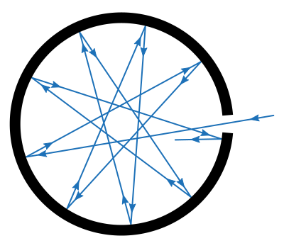
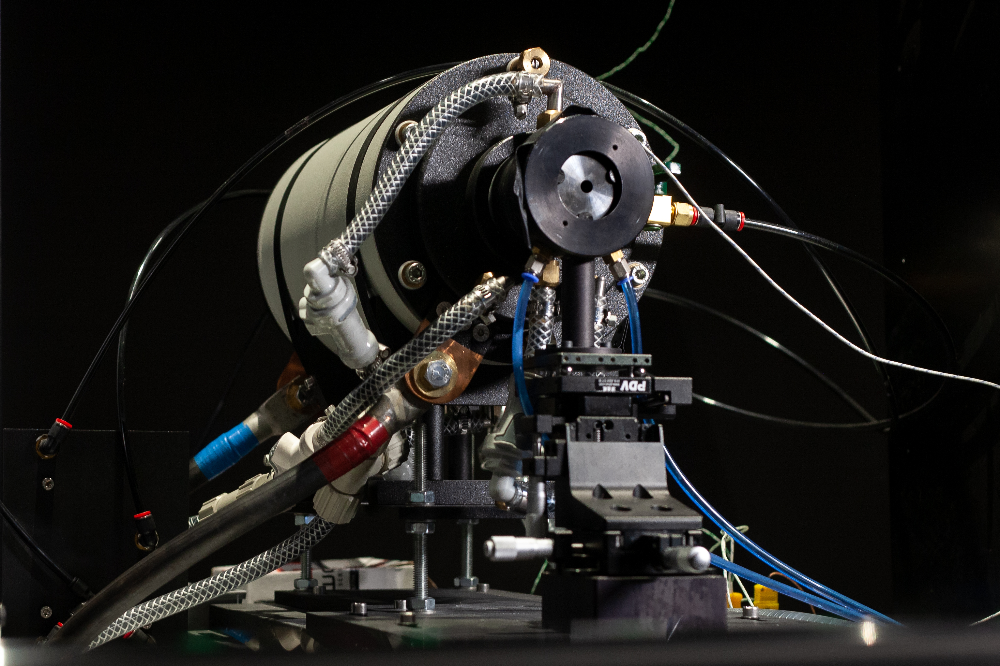

# Introduction

Astrophysics and cosmology is about understanding celestial objects and the universe in terms of their present state, their diverse features, and evolution from the past to the future. Limited by our physical ability, we can at best deriving knowledge about the physical processes taking place far away and long ago only by applying our most advanced understanding of the law of nature to observations collected near the earth. As a consequence, our fundamental physics and astrophysics modeling are constantly put into test against the lastest data, resulting in either confirmation or rasing chanllenges that pushes forward the frounier of our comprehension of the nature.

This very concise course is an introduction of some main subjects discussed in the field of astrophysics dedicated to undergraduate students who have already enough basics concepts in physics. By making this, I intend to illustrate tow major aspects about astrophysics:

- How different fields of physics are orchestrated to derive far reaching information about the universe, for which direct experimental probs are impossible. 
- The main currently established conclusions of physical processes involved in celestial events and the universe.

As a field of (rather) applied physics, undergraduate level of several subjects are pre-request to following this course, which includes:

- Multivariable calculus and different coordinate systems
- Newtonnian mechanics, gravity, and orbital mechanics.
- Continuous mechanics, hydrodynamics, and transport.
- Thermodynamics.
- Wave physics.

a part from subjects having being the center of astrophysics since early 1900s, including:

- Quantum physics
- Special and General relativity.
- Statistical physics
- Nuclear physics

that will be introduced as needed along the way of presentation. 

The mission I take to create this lecture notes is to put basic physics concepts in the context of astrophysics and to plot a not detailled but sensible story of the universe for readers equipped with an essential scientific toolbox to have sipe of the power they dispose when applied to comprehend the universe.

# Mapping celestial objects

Although We nowadays take the fact that our earth is spinning spherical object circulating around the sun for granted as a common sense knowledge taught since our early ages, it is pretty unobvious for any person to justify this realisation without the background of modern science culture. 

A brief history to establish the primary version of the currently well accepted solar system model is summarised in the following table.

**Table.1** {#Table.1} Historical developpement of the solar system model
| **Name**                 | **Year**  | **Key Contribution**                                                                                     |
| ------------------------ | --------- | -------------------------------------------------------------------------------------------------------- |
| **Aristarchus of Samos** | \~270 BCE | First to propose a **Heliocentric** (Sun-centered) model and estimate the Sun is much larger than Earth. |
| **Claudius Ptolemy**     | \~150 CE  | Finalized the **Geocentric** (Earth-centered) model using "epicycles," which ruled for 1,400 years.      |
| **Nicolaus Copernicus**  | 1543      | Published the first modern mathematical **Heliocentric model**, placing the Sun at the center.           |
| **Tycho Brahe**          | \~1580    | Recorded the most accurate **pre-telescopic data** of planetary positions in history.                    |
| **Johannes Kepler**      | 1609–1619 | Discovered that planets move in **ellipses** and established the three Laws of Planetary Motion.         |
| **Galileo Galilei**      | 1610      | Used the **telescope** to discover Jupiter's moons and Venus's phases, proving the Earth orbits the Sun. |
| **Giovanni Cassini**, **Jean Richer**    | 1672      | Used **parallax** (Paris to South America) to measure the first real distance to Mars and the Sun.       |
| **Isaac Newton**         | 1687      | Published the **Law of Universal Gravitation**, explaining _why_ planets stay in their orbits.           |

By the mid of 1600s, it has been well established that in our solar system six planets (Mercury, Venus, Earth, Mars, Jupiter, and Saturn) surround the sun on their own (near circular) eliptical oribites with the sun sitting on a focus point. However the actual length scale, for example, the distance measured in meters between the sun and the earth, was unknown, and all length scales in solar system, with well determined proportionalities, is only expressed in the unit of the average distance between the sun and the earth. This distance, as a natural choice of length unit to measure celestrial events, is called one **astronomic unit**, i.e. 1 **a.u.**. It was not until 1672 when the distance between the mars and the earth was firsty measured in meters using the **parallax** method, the absolute length scales of the solar system has been determined (other length scales can be determined by combining the known proportionalities and the earth-mars distance measured in meters).

During the early development of the solar system model, and all later astronomical measurement, based on which is developped the modern astronomy, two key concepts played fundamental roles. These two concepts are **equatorial coordinate system** (or **equatorial grid**) and **parallax**. Equatorial grid is the basis for describing the motions of celectial objects on our sky, which are 2D projections of 3D positions on the sky, an imaginary spherical surfance that encloses the earth. This is the crucial step allowing Kepler to apply the idea of parallax to derive his famous three laws of planetary motion and therefore to obtain the scale free but proportionality precise geometry of the solar system. Parallax is primary method in determining an object distance without physically measuring it with a rule, but also the idea behind Kepler's construction. The equatorial grid can be viewed as the set-up of measuring equipement and parallax is the mathmatical principle transforming the measurments to locations and motion of celetial objects. Parallax principle, as up to late 2025, is still the method used to precisely locating about 1.5 billion stars ($\approx 1\%$ of the milky way population) in Gaia project of European Space Agency (ESA). 

In the following, we shall discuss fairly in detail these two concepts from a modern perspective, without evoking much their historical roles in deriving the solar system model ([Table.1](#Table.1)).

## Equatorial grid

  
  
<em>Figure 1: Celestial sphere and half of horizon coordinate system.</em>

  
  
<em>Figure 2: Equatorial coordiante system.</em>

  
  
<em>Figure 3: Revolution of the earth around the sun.</em>

To describe the location and motion of an object, one needs to set up a coordinate system. To describe the motion of stars in the sky, one needs to set up a coordinate system on the sky. Observing the sky from anywhere on the earth (assuming no obsticals to cover any conner of the sky until it reaches the horizon), any object apearing in the sky, either a star or an aircraft, at a given moment $t$ can be localised by two numbers, a horizontal degree determining in which horizontal direction (e.g. 30 degrees from local north to local east) you are pointing sight and a vertical degree determining to which height (e.g. 60 degree from the horizon or equivalently 30 degree below the zenith) you are pointing your sight. This coordiante system, called "horizon coordinate system", is the natural system one would use  as an observer immobile on the earth taking himself as the reference, or the "orignin". The horizontal degree is called "azimuth" (Az) and the vertical degree is called "altitude" (Alt). 

Using this method to label the position of an object, any object above the horizon, the observer discards the distance of the object from himself. Actually, the two coordiantes (Alt & Az) marks the position of any 3D objects projected by linking the observer and the object onto an imaginary hemisphere above the ground (or horizon). For the purpose of astronomy measurement, this sphere, called "**celestial sphere**", is technically defined as co-centric with earth with an infinite radius, such taht the plan defined by the horizon circle is a great circle of the celestial sphere separating it in half and contains entirely the great circle of the earth perpendicular to the observer's zenith direction (due to infinite radius). Horizon coordiante system is one option to draw a grid of lines on the celestial sphere for labelling a projected position. It is also straightfoward to see that it is a sphereical coordiante system forgetting the radial coordinate.

This horizon coordinate system is very unconvenient for astronomical studies, because the earth spins on itself and this coordinante system is attached to a location on the earth. That is, even all celetial objects, inlcuding the earth itself, move little relatively one to another when projected on the celetial sphere, objects other than the earth will move together pretty fast together in the horizon coordiante system due to the spin. To study the position and motion of  celetial objects relative to the earth, one shall come up with a coordiante system that does not spin with the earth, but rather moves in parallel together with the night stars if they were all immobile relative to the earth. Hence, keeping a spherical type coordiante system to labe positions on the celestial sphere, one then needs to find the z, x direction (or "north pole" and the "prime meridian" respectively) that are relatively stable comparing the other stars.

Such a system is the **equatorial coordinate system** or **equatorial grid**. The z direction, called the "north celestial pole" is just the earth geological north pole, around which the earth spins on itself and which remains relatively stable to the universe (with a weak periodic wobbling of period 25,800 years). The equator, i.e. the greate circle on the celestial sphere perpendicular to the earth self-spin axe, is called **celestial equator**. **Declination** ($\delta$) is the angular distance south or north from the celestial equator, varying from $-90^\circ$ at the "celestial south pole" to $90^\circ$ at the celestial north pole. The x direction "prime meridian" is defined as the "vernal equinox" point on the celestial equator. The vernal equinox point is the determined by intersecting the revolution plane (earth orbite around the sun) with the celestial sphere, resulting in another greate circle called "ecplitic" (along which are constellations). Since earth rotation axe is $23.5^\circ$ inclined with revolution plane, so the celestial equator and the ecliptic.  The place where the ecliptic is most south to the celestrial euqator corresponds to the "winter solstice", and the opposite place where the ecliptic is most north to the celestrial euqator corresponds to the "summer solstice". Looking from the north  to the south, moving along the ecliptic anticlockwise from the "winter solstice" to the "summer solstice", the  ecliptic intersects with the celestiral equator at "vernal equinox" corresponding to the sprin. Continuing circulating anticlockwise from "summer solstice" to "winter solstice" encounters the second intersection "autumnal equinox". The vernal equinox is taken as the "prime meridian" in the equatorial grid, and the longitude-like coordinate measured eastward from this “Prime Meridian” is called the **right ascension** ($\alpha$). By convention, right ascension is counted in hours, minites and seconds, with 1 hour = $15^\circ$. 

One can verify that the north celestial pole and the vernal equinox of equatorial grid remain constant directions to a universe that were immobile relative to the sun, despite of the self-rotation and revolution of the earth. Considering the size of the universe (e.g the nearest start is 268,770 au), it is safe to assimilate the sun and the earth as the same point, and hence the stars labelled using equatorial grid applies to the sun as well as to the earth.

The use of equatorial coordinate system simplifies tromendously the analysis of celestial motions data as it removes the earth rotational "artifact". In fact, Brahe made very complete and detailed record of positions of planets, such as mars, using the horizon coordinate system. Only after Kepler transformed Brahe's data into the equatorial coordinates, the patterns of the Kepler's three laws began to surface above the muddy water of large data. After all the rotation of the earth is mostly irrelevant to the physics of planetary revolution around the sun.

[Stellarium](https://stellarium-web.org/)

## Parallax

Roughly speaking, **parallax** refers to the apparent shift in "position" of an object when viewed from different "perspectives". We will clarify what does it mean exactly by "position" and "perspectives". The principle of parallax is the primary tool to measure the position, inlcuding the distance, of an object difficult to measure physically with ruler. We will discuss this concept in 2D and easily generate it into 3D.

> Example:
> How to measure the height of Effel tour?

### Parallax in 2D

When observing an object $T$ in a 2D space from a fixed point $O$, one can only describe the its position by some angle $\theta$ once a coordinate system is set up, losing the information about its distance. This angle, as an analogy with the describing objects in the sky, is a projection of the 2D object on to an imaginary circal centered at the point of observation. Now if the observer moves himself to a second position $O'$, while carefully recording the distance $\ell$ he has moved and the direction, that is either the angle $\phi$ of the vector $\overline{OO'}$ in the measured from the position $O$ or  the angle $\phi'$ of the vector $\overline{O'O}$ in the measured from the position $O'$, but with respect to **same** coordiante system, he will be reconstruct the triangle $\triangle OTO'$ using the law of cosines. Let $d = |\overline{OT}|$ and $d'=|\overline{O'T}|$. We have $|\angle TOO'| = |\theta -\phi|$ and $|\angle TO'O|=|\theta'+\text{sign}(\phi)\cdot\pi-\phi|$, and in particular the **parallax angle shift** $|\angle OTO'| = |\theta'-\theta|$. We solve exactly $d$ and $d'$ via 

$$ 
\begin{aligned}
d'^2 &= d^2 + \ell^2 -2d\ell \cdot \cos(\theta-\phi) \\
d^2 &= d'^2+ \ell^2 -2d'\ell\cdot \cos(\theta'-\text{sign}(\phi)\cdot\pi-\phi)
\end{aligned}
$$

#### Large distance approximation

When the distance $d$ and $d'$ is very large compared to the displacement $\ell$ ,i.e. $\mathcal{O}(d/d')\sim 1$ and $\ell/d \sim \ell/d' \ll 1$, and hence the parallax angle shift $\Delta \theta \equiv |\theta-\theta'|$ is also very small, we may set $d_p\approx d\approx d'$ and write $\tan(\Delta\theta/2)=\ell/(2d_p)$. To the first order, we have 

$$
d_p = \frac{\ell}{\Delta\theta}
$$

Assimilating $O$ and $O'$ as roughtly the same position with respect to the scale of the largely distant object $T$, one may conclude $T$ is located at $(d_p, \frac{\theta+\theta'}{2})$ in a polar coordinate orgined at $O$ ($O'$). 

#### "Background"

From the large distance approximation, one also derive that as the distance $d\approx d'$ of the object becomes infinite comparing the moving distance $\ell$, the parallax shift $\Delta \theta$ vanishes. Objects so far away such that its parallax shift becomes negligible with respect the typical observaer moving scale $\ell$ are called "background". 

The ensemble of background object, since they are apparently immobile on the projection circle defined by the observer, can themselves be used equivalently as the coordinate system to mark parallax shifts of relatively close objects. This the usual form of parallax principle. 

Consider two background objects $B$ and $B'$, by moving himself from $O$ to $O'$ by a distance $\ell$, the observer notices that the target object $T$ shifts from conciding with $B$ to $B'$. Since $B$ and $B'$ are in the background, the parallax angular shift of $T$ can be directly assessed by measureing the angle $\Delta\theta=|\angle BOB'|\equiv |\angle BO'B'|$, then the distance $d_p$ of target $T$ can be computed as $d_p = \ell/\Delta\theta$.

#### A remark on using the parallax with a background

- Using background objects as the replacement of the coordinate system neglected the theoretically existing but experimentally currently non-accessible parallax anglular shift of those background objects. This conceptually gives up the chance to measure background object distance.
- A conceptually better and more potential pratice would be to set-up a coordinate system as precise as possible, and to measure the parallax shift of all present objects. As such, the only limit of parallax method is the experimental techniques in precise measuring, but not conceptual.

### Parallax in astronomy

We now can easily generate our previous discussion in to 3D in the context of astronomy. The coordinate system that we set up is the equatorial grid, and the parallax shift of any close enough objects in the night sky is due to the revolution of the earth around the sun. The only different is that, we have the parallax shift in a two dimensional system specified by the shift of declination and right ascension from $(\delta, \alpha)$ to $(\delta', \alpha')$. In this case, the parallax shift $\Delta\theta$ can be computed using the theorem of cosine 

$$
\cos(\Delta \theta) = \sin(\delta)\sin(\delta')\cos(\alpha-\alpha')+\cos(\delta)\cos(\delta')
$$

And we observe the parallax shift of close celestial objects while circulating the sun on a nearly circular orbite with an average radius defined as $1$au. Since our motion as an observer is circular, the apparent parallax shift  traces ellipses with more or less elongation depending it orientation compared with the normal direction of the revolution plaine.

[Gaia video](https://www.youtube.com/watch?v=0-jhyRIupY4)

#### Parsec

**Parsec** the natural length unit when combining the earth-sun distance scale $1$ au and the parallax principle. $1$ parsec is the distance for which a displacement of $1$ au causes a parallax shift of 1 arcsecond, where $1$ arcsecond (arcsc) $=$ $1/60$ arcminutes, and $1$ arcminute $=(1/60)^\circ$.

#### Proper motion

Celectial objects are rarely immobile relative to the sun, that si the proper motion of celestial  objects. Depending on the velocity relative to the sun, the parallax shift continuously monitored may draw different spiral shapes. By making proper model of the parallax motion starting from the proper model, the proper motion can then be deduced by combining the model and the continuous parallax shift data.

## Cosmos distance ladder

XXX

# Thermal Radiation, light and Electromagnetic waves

In modern astrophysics, there are four categories of signals comming from the space serving us to collect information about the universe:

- Electromagnetic radiation (or wave).
- Highe energy particles (proton, atomic nucleus), also known as "cosmic rays".
- Gravitational waves.
- Neutrinos.

It is the electromagnetic radiation that we are going to dive in for the sake of this introductory course to astrophysics. Nonetheless, essential information about the other types of signals are provied in the following box.

> - **Cosmic rays** - These are not "rays" of light, but high-energy fragments of atoms (mostly protons  and atomic nuclei) traveling at nearly the speed of light.
>   - _Source_: The Sun (solar flares), supernova explosions, and distant active galactic nuclei.
>   - _Detection_: When they hit Earth's atmosphere, they create a "shower" of secondary particles that can be detected by ground-based sensors.
>
> - **Gravitational waves** - Unlike light, which travels through space, gravitational waves are ripples in the fabric of spacetime itself.
>   - _Source_: Accelerated massive objects, such as colliding black holes or merging neutron stars.
>   - _Detection_: Facilities like LIGO and Virgo use lasers to measure microscopic changes in distance caused by these ripples passing through Earth.
>
> - **Neutrinos** - Neutrinos are nearly massless subatomic particles that rarely interact with matter. They are often called "ghost particles."
>   - _Source_: Nuclear reactions in stars, supernovae, and the cores of active galaxies. Because they pass through stars and dust clouds without stopping, they provide a "clean" signal from the very heart of the most dense objects in the universe.
>   - _Detection_: Because neutrinos rarely interact with matter, they cannot be seen directly; instead, they are detected by the "debris" they leave behind during rare collisions with atoms. Most modern observatories use massive volumes of water or ice—often deep underground to block out interference—as a target. When a neutrino occasionally strikes an atomic nucleus in this medium, it produces secondary charged particles like electrons or muons that race through the liquid or ice. Because these particles travel faster than the speed of light in that specific medium, they emit a faint blue glow known as Cherenkov radiation, which is captured by thousands of sensitive light sensors to reconstruct the neutrino's original energy and direction.

By the end of 1800s, thermal radiation and visible light have been revealed to have the same physical nature as the electromagnetic (EM) wave. While visible light represent only a narrow band ($400\sim 800$ nm) on the entire spectrum of EM wave, thermal radiation is nothing but the effect of energy transport carried by the electromagnetic wave, just  as any  wave would do, except that EM wave can travel even in the vacuum with a universal constant speed $c\approx 3\times10^8 m/s$.

The energy transfer carried by EM wave is a form of heat transfer, i.e. thermal radiation (the other forms of heat transfer including conduction and convection), that eventually affects the internal energy of an object (or system) under the radiation. For example, if two objects at different temperatures put at distance in isolated vaccum, which guarantees no energy or material exchanges with the external world and thermal radiation being the only way of energy exchange internally, after some time, these two objects will arrive at thermal equilibrium eventually at a same new temperature.

Actually, it is an abondant phenomena that materials (the of making of any object) at a finite temperature (above $0K$) emmit EM wave lossing energy in the form of thermal radiation, and also absorb EM wave if there is thermal radiation coming in from other sources. It is a primary hint that there is an close relation between materials and EM radiation. Indeed, it is this close relation between matrerial and EM wave allowing us to infer rich information about celestial objects far away in the space by analysing their EM emission. We shall evoke some core concepts in charactersing EM emission that are essential for making sense of signals from the sky.

## Monochromatic waves & Superpostion

In most of cases, the EM wave we are dealing with is a mixture of monochramatic waves. In fact, all physically relevant waves can be expressed as a superposition of monochratic plane waves. An EM monochromatic plane wave formally reads as a pair of electric and  magnetic field

$$
\mathbf{E}(\mathbf{r},t)=\mathbf{E}_{\mathbf{k}}\cdot \cos(\mathbf{k}\cdot\mathbf{r}-\omega t + \phi)\quad\text{and}\quad\mathbf{B}(\mathbf{r},t)=\mathbf{B}_{\mathbf{k}}\cdot \cos(\mathbf{k}\cdot\mathbf{r}-\omega t + \phi)
$$

where the wave vector $\mathbf{k}$ and the angular frequency $\omega$ statisfy the dispersion relation $\omega/|\mathbf{k}| = c$ ($c$ being the speed of light), and the $\mathbf{k}$  dependent vectorial amplitudes obey

$$
\mathbf{B}_{\mathbf{k}} = \frac{1}{c}\hat{\mathbf{k}} \times \mathbf{E}_{\mathbf{k}} \quad\text{with}\quad \hat{\mathbf{k}} \equiv \frac{\mathbf{k}}{|\mathbf{k}|} \quad \text{the unitary vector and }\quad\mathbf{k}\cdot\mathbf{E}_{\mathbf{k}} = 0
$$

Letting $\lambda$ and $\nu$ be the wavelength and the frequency, we also have

$$
|\mathbf{k}|\equiv \frac{2\pi}{\lambda} \quad \text{and} \quad \omega \equiv 2\pi\nu
$$

The unitary wave vector $\hat{\mathbf{k}}$ represents the direction of propagation along which equal phase planes travel, as can be seen by setting the total phase $\mathbf{k}\cdot\mathbf{r}-\omega t + \phi$ to some constante.

> **Electromagnetic spectrum** - The classification of electromagnetic waves according to the wavelength (or frequency)
>
> 

>  
>  
<em>Figure 4: Electromagnetic spectrum.</em>

>

### Celestial objects seen via EM emission

XXXX

## Description of the energy transport of EM wave

### Poynting vector & Energy flux

For an arbitrary EM wave, i.e. a pair of space-time dependent electric and magnetic field $(\mathbf{E}(\mathbf{r},t), \; \mathbf{B}(\mathbf{r}, t))$, the energy flux at $(\mathbf{r},t)$ is described by the Poynting vector defined by

$$
\mathbf{S}(\mathbf{r}, t) \equiv \frac{1}{\mu_0} \mathbf{E}(\mathbf{r}, t)\times \mathbf{B}(\mathbf{r}, t)
$$

where $\mu_0$ is the magnetic permeability in the vacuum for simplifying our dicussion. Poynting vector represents along which direction the energy flows at which rate (i.e. per time) per unity of perpendicular area, with a dimension $\text{J}(\text{s}\cdot \text{m}^2)^{-1}$. For example, for an elementary area $dA$ facing direction $\hat{\mathbf{n}}$ sitting at position $\mathbf{r}$ and moment $t$, the energy passed that area during a time $dt$ is given by

$$dE(\mathbf{r}, t)= dt dA\hat{\mathbf{n}}\cdot \mathbf{S}(\mathbf{r},t)  $$

Consider an example of EM wave composed by three monochromatic plane waves of wave vector $\mathbf{k}_1$, $\mathbf{k}_2$ and $\mathbf{k}_3$, namely

$$
\begin{align}
\mathbf{E}(\mathbf{r}, t) &= \mathbf{E}_{\mathbf{k}_1}\cos(\mathbf{k}_1\cdot\mathbf{r}-\omega_1t)+\mathbf{E}_{\mathbf{k}_2}
\cos(\mathbf{k}_2\cdot\mathbf{r}-\omega_2t) +\mathbf{E}_{\mathbf{k}_3}
\cos(\mathbf{k}_3\cdot\mathbf{r}-\omega_3t) \nonumber \\
\mathbf{B}(\mathbf{r}, t) &= \mathbf{B}_{\mathbf{k}_1}\cos(\mathbf{k}_1\cdot\mathbf{r}-\omega_1t)+\mathbf{B}_{\mathbf{k}_2}\cos(\mathbf{k}_2\cdot\mathbf{r}-\omega_2t) +\mathbf{B}_{\mathbf{k}_3}
\cos(\mathbf{k}_3\cdot\mathbf{r}-\omega_3t)
\end{align}
$$

where $\hat{\mathbf{n}}\equiv\hat{\mathbf{k}}_1 = \hat{\mathbf{k}}_2$ and $|\mathbf{k}_1|\neq|\mathbf{k}_2|$. That is, monochromatic wave 1 and 2 propagate in the same direction $\hat{\mathbf{n}}$ with different wavelengths (or frequencies) and wave 3 is an arbitrary monochromatic wave propagating in a different direction $\hat{\mathbf{n}}'\equiv \hat{\mathbf{k}}_3$ with another different wavelength (or frequency).

Applying the definition of Poynting and the relation between $\mathbf{E}_{\mathbf{k}}$ and $\mathbf{B}_{\mathbf{k}}$, one obtains the energy flux averaged over time

$$
\langle\mathbf{S}\rangle(\mathbf{r}) = \frac{1}{2\mu_0c} |\mathbf{E}_{\mathbf{k}_1}|^2\hat{\mathbf{k}}_1 + \frac{1}{2\mu_0c} |\mathbf{E}_{\mathbf{k}_2}|^2\hat{\mathbf{k}}_2 + \frac{1}{2\mu_0c} |\mathbf{E}_{\mathbf{k}_3}|^2\hat{\mathbf{k}}_3
$$

> **About the average** - In fact, the EM wave emitted by certain object at some temperature $T$ is a mixture of a monochromatic waves of all kinds, such as wavelength, direction, phase off-set, and polarisation. To describe the energy flux at a macroscpic level, one shall perform not only an average over microscopic time, i.e. the time scale of typical EM wave period, but also an average over thermal fluctuations due to a finite temperature $T$. We are here taking a simple example, which necessites only the time average, to illustrate the idea that the energy flux of a EM wave is summed over contributions from plane waves of different wavelength and directions. Note also the time scale of typical EM wave period is $T=\lambda/c$, which even for radio waves is extremely small.

In the above example, it is clear that the total energy flux is composed by three energy flux contributions. $\mathbf{S}_1\equiv \frac{1}{2\mu_0 c}|E_{k_1}|^2 \hat{\mathbf{k}}_1$ represents the energy flux component in the direction $\hat{\mathbf{n}}$ from the frequency $\nu_1$ (or wavelength $\lambda_1$), and $\mathbf{S}_2\equiv \frac{1}{2\mu_0 c}|E_{k_2}|^2 \hat{\mathbf{k}}_2$ represents the component in the same direction $\hat{\mathbf{n}}$ but from a different frequency $\nu_2$. Finally $\mathbf{S}_3\equiv \frac{1}{2\mu_0 c}|E_{k_3}|^2 \hat{\mathbf{k}}_3$ represents the energy flux contribution yet in another direction $\hat{\mathbf{n}}'$ and another frequency $\nu_3$.

### Macroscopic energy flux & Specific Intensity

This example actually reveals the general way to describe the macroscopic energy flux due to a mixed EM wave ("macroscopic" referting to being averaged over both microscopic time and themal fluctuations), that is the total energy flux can always written as a sum of contributions from energy flux in each direction and each frequency (or wavelength). As direction, e.g. $(\varphi,\theta)$ in a spherical coordinate, and frequency $\nu$ are both continueous variables, it is rather an integration over solid angle and frequency instead of summation. Hence

$$
\langle\mathbf{S}\rangle = \int d\Omega\int_0^\infty d\nu  I(\nu, \hat{\mathbf{n}})\hat{\mathbf{n}}
$$

where $I(\nu, \hat{\mathbf{n}})$ is called **specific intensity** quantifying the energy flux contribution from frequency $\nu$ per $d\nu$ in the direction $\hat{\mathbf{n}}$ per element of solid angle $d\Omega$. In a spherical coordinate, we have $d\Omega(\varphi, \theta)=d\varphi d\theta \sin\theta$ and $\hat{\mathbf{n}}=\sin\theta\cos\varphi\hat{\mathbf{x}} + \sin\theta\sin\varphi\hat{\mathbf{y}} + \cos\theta\hat{\mathbf{z}}$.

In principle, the macroscopic energy flux $\langle\mathbf{S}\rangle$ as well as its components $I(\nu,\hat{\mathbf{n}})$ is associated with a location $\mathbf{r}$ and also a "macroscopic" moment $t$, i.e. $\langle\mathbf{S}\rangle(\mathbf{r},t)$ and $I(\mathbf{r},t;\nu,\hat{\mathbf{n}})$. (A "macroscopic" moment $t$ means that significant variation of the macroscopic energy flux at a given location occurs only for a $\Delta t$ much larger the miscroscopic time scale.) For the time being, let's bear in mind that there is indeed this space-time dependence while dropping them for a lightened notation.

#### Isotropic radiation, Spectrometer & Brightness

When thermal radiation is concerned, it is common to have an **isotropic** radiation field, that is the specific intensity does not dependent on the direction, i.e. $I(\nu, \hat{\mathbf{n}})=I(\nu)$. In this case, we may compute the total energy flux across an elememnt area $dA$ facing $\hat{\mathbf{n}}_A$ by integrating over half of the entire solid angle "above" the area element while using $\hat{\mathbf{n}}_A$ as the $\hat{\mathbf{z}}$ direction to express $d\Omega(\varphi,\theta)$ and $\hat{\mathbf{n}}(\varphi, \theta)$. We have

$$
\begin{align}
dA \cdot S\equiv dA\cdot\hat{\mathbf{n}}_A\cdot \langle\mathbf{S}\rangle &= dA\int_0^\infty d\nu I(\nu)\int_0^{2\pi}d\varphi\int_0^{\pi/2} d\theta\sin\theta (\hat{\mathbf{n}}\cdot\hat{\mathbf{n}}_A) \nonumber \\
&= dA\int_0^\infty d\nu I(\nu)\int_0^{2\pi}d\varphi\int_0^{\pi/2} d\theta\sin\theta \cos \theta \nonumber \\
&= dA  \int_0^\infty  d\nu F(\nu) \quad \text{with} \quad  F(\nu) \equiv \pi I(\nu)
\end{align}
$$

A **spectrometer** detector placed at the position of $dA$ facing $-\hat{\mathbf{n}}_A$ measuring the spectrum composition of a radiation coming from some source, actually measures the quantity $F(\nu)$ appearing in the above equantion. $F(\nu)$ represents the energy flux contribution from the frequency $\nu$ per $d\nu$ in the entire radiation flux, thus $F(\nu)$ may be called radiation intensity per frequency.

The **brightness** is defined as the total energy flux (i.e. power per area) received by that detector across the entire range of spectrum, which simply is the integration over all frequency, i.e. $B \equiv \int_{\mathbb{R}^+} d\nu F(\nu)$. It is clear and worth emphysizing that if the radiation in question comes from some source, say a star, then the brightness is not a propery of the source since it is related to the location placed the detector.

Assume the radiation in question comes from some source, say a star, and consider a volume $V$ entirely enclosing the source. The integration of $dA\cdot S$ over all the entire surface of $V$ gives the **Radiation power** of the source. Formally

$$
P = \int_{\partial V} dA\cdot S
$$

where $\partial V$ represents the surface of $V$ with normal vectors $\hat{\mathbf{n}}_A$ pointng outward. Because of **energy conservation**, the radiation power computed along any volum surface should be the same, as far as the source is entirely enclosed in that volume. Hence the radiation power is an intrinsic property of the emission source. When coming to a star, it is called the **luminosity**.

# Star Luminosity & Brightness

A star is a source of EM radiation spreading energy into the space.
The **luminosity**, denoted $L$, of the star is defined as the total power of EM radiation. The energy transport by EM emission of this star can be described using the energy flux field $\langle\mathbf{S}\rangle$. Details of frequency and directional contributions are for the moment disgarded.

Consider the star as a perfect sphere of radius $R$ and the EM radiation is isotropic. In this case, the energy flux is always along the outward radial direction $\hat{\mathbf{r}}$ and its intensity $S(r)$ depends only on the distance $r$ from the star center  with $r\geq R$. Hence

$$
\langle \mathbf{S} \rangle(\mathbf{r}) = S(r)\hat{\mathbf{r}} \quad \text{with} \quad \mathbf{r} = r\hat{\mathbf{r}}
$$

The luminosity can be computed on the star surface, which leads to

$$
L = 4\pi R^2 S(R)
$$

By energy conservation, the same power is obtained on an arbitrary sphere co-centered with the start with $r\geq R$. Therefore

$$
L = 4\pi r^2 S(r) \iff S(r)=\frac{L}{4\pi r^2} = \frac{R^2}{r^2}S(R)
$$

That is the energy flux inversely proportional to the distance from the star squared.

Suppose now, we observe the star from a distance $d>R$, the **brightness** of the star is defined as its appearance at distance $d$ as measured by the local energy flux. Hence the star brightness at $d$ is given by

$$
B(d)=S(d)=\frac{L}{2\pi d^2} = \frac{R^2}{d^2} S(R)
$$

We shall later see that the energy flux at the surface of an object can be infered by measuring the spectrum of its emission, as a consequence, we can infere the size and the luminosity of a star if we know its distance by, for example, parallax, and its emission spectrum that can be very well measured from ditance.

# Kirchoff's theorem of radiation

The revelation of the mateiral-EM wave interaction, and henceforth the dawn of quantum physics, started from interogating the how does material (or an object) emit and absorb thermal rediation in harmony with the principles of thermodynamics. Two main achievements during the 19th centry have been enclosed in name of Gustav Kirchhoff:

- Kirchhoff's 3 laws of spectroscopy - These are a set of empirical laws paving the way of modern spectrometry of EM waves. As we shall review in a latter section, these laws can be viewed as a theoretical consequences of more profound "Kirchhoff's theorem of radiation", and deeply related to photo-atomic interactions.
- Kirchhoff's theorem of radiation - It reveals universal properties that thermal radiation of materials should satisfy in order to be consistent with the principles of thermodynamics. It directly drives the search of black body radiation that later opened the door to quantum physics.

In this section, we will sketch the derivation of Kirchhoff's theorem of radiation and introduce the concept of universal black-body radiation law.

## Definitions

The theorectical deductions about thermal radiation done by Kirchhoff was based on accumulation of empirical results, which we shall here summarize as "definitions" to perform our own version of the reasoning process.

- For an object held at a temperature $T$, if there is no other source of thermal radiation, the specific intensity $I_e(\nu, \hat{\mathbf{n}})$ at the surface of the object, by which the object spread out energy, depends only on the temperature $T$ and its material labelled by a letter "$i$". In other words, **the emission spectrum, described by the functional form of $I_e(\nu)$ is completely determined by the type of emitting material and the temperature at which it is emitting**. For simplicity, we shall also neglect the dependence on the direction $\hat{\mathbf{n}}$ by assuming isotropic symmetry in the object. Therefore, we use $I_e(\nu; T, i)$ for denoting the outward emission intensity spectrum (specific intensity) of some object.

- We define a **thermalbath of thermal radiation** (of an arbitrary material) such that its temperature is held at $T$ constantly and the only way for energy exchanging with an object put into "contact" is through mutual thermal radiation (inlcuding both emission and absorption). Such an thermalbath can be mentally constructed as a cavity of vacuum (no intermediate substance for thermal conduction or convection), and other objects put inside the cavity are in "contact" with the thermalbath via EM radiation.

- **Equilibrium radiation field** (of a system in contact with a thermalbath at $T$). In the equilibrium state formed by some configuration, such as the material types and positions of a number $n$ objects put in contact with the thermalbath (with $n\geq 0$, yes $0$ included), we may associate for each position a local specific intensity $I_B(\mathbf{r};\nu, \hat{\mathbf{n}};T)$ to desribe the radiation field. Since we consider only the equilibrium state, there is no dependence on time $t$. We shall later derive properties of this field $I_B$ required by thermal equilibrium. One property among others is that it does **NOT** depend on the material forming the thermalbath but only the temperature.

- An object held at a temperature $T$, absorbes energy via EM radiation from other sources with an **absorption ratio**, denoted $\alpha(\nu;T,i)$, while instantaneously emitting EM radiation with intensity $I_e(\nu;T;i)$. Let the incident radiation specific intensity due to its environment at some location on the object surface be $I_I(\nu)$. For simplicity both incident radiation and the abroption rate are assumed isotropic. **The specific intensity absorbed by the object is determined by the absorption ratio via $I_a(\nu;T,i) = \alpha(\nu; T,i)I_I(\nu)$, and by definition $0\leq\alpha(\nu;T,i)\leq1$**. The absorption ratio thus describes how much percentage of the incident energy at frequency $\nu$ is actually absorbed, and it is also an instrinsic property of material "$i$" at temperature $T$. The incidient emssion non-aborbed, i.e. the $1-\alpha$ part, is either scattered or transmitted.

- We define a class of materials (or objects) called **black-body** when its absorption ratio $\alpha(\nu; T, i)=1$ for all $\nu$ at that temperture $T$. When the absorption ratio is $1$, it does not reflect EM waves at all, including any visible light. Hence, by observig light from an external source scattered (synonym of "reflected") by the object, which is the usual way we see by eyes an object, it appears completely "black". Here come some remarks:
  - However, nothing prevent a black-body from "glowing", i.e. emitting visible light via $I_e$, when its temperature is in the right range (neither too hot nor too cold emits enough visible light).
  - As the absorption ratio $\alpha(\nu;T,i)$ is temperature dependent for certain material "$i$", it could happen that at some temperature (usually low temperature) $\alpha(\nu;T,i)$ is far from being constantly $1$ for the entire specturm $\nu$, while at some other temperature (usually high temperature), $\alpha(\nu;T,i)\approx 1$ for the entire frequency range. The same object can still be considered as  a "black-body" in the later situation but not in the former one. An ideal "black-body" would be one that has $\alpha =1$ for all frequencies for all temperature.
  - The concept of **black-body radiation** is central to the developement of modern physics (including quantum physics, astrophysics, etc). As we shall see, it does not only describe an universal emission behaviour of a specific class of objects, but more profoundly describes the thermal equilibrium of photon gas.

## Radiation theorem of Kirchhoff

Before diving into the its derivation, we directly give the statement of Kirchhoff's radiation theorem. With the above definitions, the Kirchhoff's radiation theorem says

- Whaterever the material $i$, the absorption ratio $\alpha(\nu;T,i)$ and the emission intensity $I_e(\nu;T,i)$ satisfy an universal relation:
  
  $$
  B_\nu(\nu, T) = \frac{I_e(\nu;T,i)}{\alpha(\nu;T,i)}\quad,
  $$
  
  where $B_\nu(\nu, T)$, called the specific intensity of "**black-body radiation**", is an universal function of frequency $\nu$ and temperature $T$, independent on material $i$. The reason $B_\nu$ is associated with the black-body is that, for a black-body with $\alpha(\nu;T,i)\approx 1$, $B_\nu(\nu, T)$ becomes identical to its emission specific intensity $I_e(\nu; T,i)$.
  
  Hence, a direct consequence of Kirchhoff's theorem is that
  > **All black-bodies, regardless its material or realisation, emit EM wave at an universal spectrum given by the specific intensity $B_\nu(\nu, T)$ solely determined by the temperature**.

  A second consequece from the Kirchhoff's theorem is that
  > **The specific instensity of radiation at the surface of any objects is upper bounded by the black-body radiation intensity $B_\nu$**, since $I_e(\nu;T,i) = \alpha(\nu; T,i) B_\nu(\nu,T)$ and $0\leq\alpha(\nu;T,i)\leq1$.

- The equilibrium radiation field $I_B(\mathbf{r}; \nu, \hat{\mathbf{n}}; T)$ in arbitrary thermal equilibrium configuration (as described in the "definitions"), is universally the specific intensity of black-body radiation. That is, equilibrium radiation field is **homogenous** and **isotropic**, i.e. $I_B(\mathbf{r}; \nu, \hat{\mathbf{n}}; T)\equiv I_B(\nu, T)$, and identically

  $$
  I_B(\nu,T)=B_\nu(\nu,T)\;.
  $$

All kirchhoff's theorem indicates is the existence and the physical meaning of a universal black-body radiation spectrum of $B_\nu(\nu, T)$, but does not specify the mathematical form of it, neither its origin. Post its proposition in the late-middle 1800s, much effort has been dedicated to experimentally charasterise and theoretically explain this universal $B_\nu$, leading to the conclusive Planck's law of black-body radiation (discussed later) in the early 1900s.

## Derivation

XXX

# Black-body radiation

Once the existence of the universal black-body radiation intensity has been revealed by Kirchhoff's theorem, it is an direct indication to experimentally characterise such an universal law and theoretically understand its origin. Historically the search of understanding black-body radiation put the classic physics (mainly electromagnetism and statistical physics) in confrontation with new observations, and drives Max Planck to introduce his famous constant $h$, opening the door to the quantum world.

## Examples of black-body

Real objects rarely satisfy the definition of black-body. By the requirements of total absorption (i.e. $\alpha=1$ for all frequency), one can however deduce some characteristics of objects that might be assimilated as black-bodies. For example, an approximative black-body must be opaque and low reflexive for most of the incidient EM waves must be absorbed instead of being reflected or transmitted. (In the case of total reflexion, you have an "white-body", and in total transmission, you have an "invisible" object.) These are only qualitative criteria for roughly distinguishing objects more "black-bodish" than some others. Only by comparing measured the radiation intensity spectrum to that of $B_\nu$ (discussed here after), one can have a precise idea whether an onbject does behave as a black-body. Here are some example in our daily life.

> - The sun 
> - Incandesccent light bulbs 
> - Electric heaters & household radiators 
> - Electric stove burners 
> - Human body and warm blooded animals

### Laboratory black-body

Black-body radiator in a laboratory is typically realised via cavity leaving a tiny hole on its compartinent wall, shown in Figure.5. By "cavity", it means, if ignoring the small hole, a 3D space completely enclosed by its compartiment wall. The compartinent wall made of opaque material is thick enough to prevent transimission of all wavelength EM wave. The interior surface of the cavity is typically rough, such that EM wave coming into the cavity through the tiny hole bounces many times inside the cavity with neglecting chance to escape out via the same tiny hole. At each bounce, a portion of the EM wave is absorbed by the compartiment wall, and after many bounces it get completely absorbed.

 
 
<em>Figure 5: Concept of laboratory black-body.</em>

The temperature of the cavity is held at a constant $T$ via maintaining the wall temperature. For the interior of the cavity, the compartiment wall forms a thermalbath of radiation. Ideally, if there is no hole, the equilibrium radiation field intensity inside the cavity is that of black-body radiation according to Kirchhoff. If the small hole is small enough for neglecting its effect on the equilibrium state, then the small hole is nothing but a detecting device for measuring the radiation field formed inside the cavity by placing a spectrometer at the hole.

Alternatively, one can consider the small hole itself as the black-body, since all EM wave incident to the hole has little chance to come out again, it perfectly matches the definition of a black-body. The radiation spectrum coming out from the tiny should then be that of a black-body. A laboratory realisation of such a device is shown in the Figure.6.

 

<em>Figure 6: A black body radiator used in CARLO laboratory in Poland.</em>

## Planck's law of black-body radiation

In the early 1900s, Planck established the law that has been proved to accurately describe the experimental measurement of black-body radiation. Planck's law of black-body radiation reads

$$
B_\nu(\nu, T) = \frac{2h\nu^3}{c^2}\frac{1}{\exp(\frac{h\nu}{k_BT})-1}
$$

where $k_B$, $c$, and $h$ are Boltzmann constant, speed of light, and the Planck's constant. The constant $h$ was introduced by Planck, somehow ad-hoc, as a unknown parameter to derive this law to match the experimental data in the high frequency range. However, it turned out that this form fits experimental data very precisely for all frequency range and all temperature with the same value of $h$, a strong indication that something is systematically correct in his calculation, eventhough his calculation did not attract much attention in the first place, probably because of the ad-hoc nature in the reasonning. $h=6.62607015 × 10^{-34} \text{m}^2 \text{kg} /\text{s}$.

Planck's law can also be written in term of wavelength $\lambda$. As $B_\nu$ is the specific intensity representing energy flux per frequency, the same law expressed in terms of wavelength denoted $B_\lambda(\lambda, T)$ shall represent the energy flux per wavelength. That is $B_\nu(\nu, T)d\nu = -B_\lambda(\lambda, T)d\lambda$, where the minuse sign $-$ is introduced to reorder the increment. This leads to

$$
B_\lambda(\lambda,T) = \frac{2hc^2}{\lambda^5}\frac{1}{\exp(\frac{hc}{\lambda k_B T})-1}
$$

### Regime separation & Wien's law

There are two regimes depending on how does $h\nu/k_BT$ compare with $1$.

- For ${h\nu}/{k_BT}\ll 1$, by developing up to the first order of the exponential, one gets
  $$
  B_\nu(\nu, T) \approx \frac{2\nu^2}{c^2}k_BT \quad .
  $$

- For ${h\nu}/{k_BT}\gg 1$, the exponential decay dominates and one gets
  $$
  B_\nu(\nu,T)\approx \frac{2h\nu^3}{c^2}\exp(-\frac{h\nu}{k_BT})
  $$

The same regime separation applies also to the wavelength domain.

The peak intensity is reached at a frequency $\nu_\text{peak}\propto k_BT/h$ or a wavelength $\lambda_\text{peak}\propto ch/k_BT$, which called Wien's desplacement law.

### Stefan-Boltzmann law

Since $B_\nu$ is specific intensity, one can compute the total energy flux through an elementary area into half of the space by 

$$
\begin{align}
S_B (T) &= \int_0^{2\pi} d\varphi \int_0^{\pi/2} d\theta \sin \theta \cos \theta \int_0^\infty d\nu B_\nu(\nu, T) \nonumber \\
&\nonumber \\
&= \sigma_\text{S.B.} T^4 \quad \text{with} \quad \sigma_\text{S.B.}=\frac{2\pi^5}{15}\frac{k_B^4}{c^2h^3} \nonumber
\end{align}
$$

For an approximative black-body at temperature $T$, $S_B(T)$ represents the energy flux at its surface, and $\sigma_\text{S.B.}$ is called the Stefan-Boltzmann constant. Hence the total energy flux of a black-body is in the 4-th power of the temperature.

### About the derivation of Planck's law

From a retrospective point of view, the theoretical description of the black-body radiation has been almostly done without Max Planck by Rayleigh and Jeans, and independently by Einstein. All theorectical derivation of the black-body radiation, inlcuding that of Planck, is based on the following considerations

- Whatever the material used to realise the laboratory black-body, since thermal equilibrium require no net energy transfer, the EM waves i.e. the carrier of the thermal radiation, must be standing waves inside the cavity.

- Standing wave configurations (compatible with the cavity geometry) must obey the Maxwell-Boltzmann statistics, i.e. the equipartition theorem.
  > _Equipartition theorem relates miscroscopic degrees of freedom, such as the velocity of molecules along each direction, to the macroscopic temperature in the thermal equilibrium state. It says that the average energy associated with a freedom that contributes only quadratically to the total energy is always $k_BT/2$ ($k_B$ the Boltzmann constant). For example, an ideal gaz of $N$ partices has $N\times (3+3)$ degress of freedoms ("3" for $v_x, v_y, v_z$ and another "3" for $x, y, z$). All these degrees of freedoms are decoupled because no energy term in an ideal gaz involves simultaneously two degrees of freedom. There is no energy associated with the coordinates $(x,y,z)$, and there is kinetic energy associated with each velocity component of each particle with an average given by $k_BT/2$. Therefore the total internal energy is $N\times 3\times \frac{1}{2}k_BT$._ The amplitude of a standing wave of certain frequency is such an degree of freedome, as each EM standing wave contributes to the total energy in a quadratic form, and there is no energy involving amplitudes of different frequencies.

- Since the equilibrium radiation field does not depend on the material nor the geometry, one can use a squared box of perfect conductor (which gives the boundary condidions easy to treat) as a theoretical model of black-body and then to perform the Maxwell-Boltzmann statistics of standing EM waves inside the box at temperature $T$.

Max Planck's invention is the following. Instead of allowing the energy $\epsilon_\nu$ of a standing wave of frequncy $\nu$ to take the classical values, which is a quadratic form in the amplitude $\epsilon_\nu\propto A_\nu^2$ with $A_\nu$ varying from $0$ to $\infty$, Planck restricted the energy $\epsilon_\nu$ to take only descrete values ralated to the standing wave frequency $\nu$. That is $\epsilon_\nu$ is only allowed take values such as $h\nu, 2h\nu, 3h\nu, \ldots$, while maintaining the Boltzmann weight i.e. the probability to have certain energy $\epsilon_\nu$ is proportinal to $\exp(-\epsilon_\nu/k_BT)$. The Planck's constante $h$ was introduced to define the hypothetic unknown consecutive energy gap, and later it became clear that $h\nu$ represents th energy of a photon at frequency $\nu$.

The discrete energy value restriction by Planck comes from no fondations of classical physics. This operation, although somehow ad-hoc, accidently introduces a different fondation into the calculation, the one from quantum physics.

# Photon & Energy-mass equivalence

# Photon material interaction

# Kirchoff's 3 laws of radiation

# Deduce star properties from the its "light"

## HR diagram

# Thermodynamics of stars

# Evolusion of stars

# S.R. & G.R.

# Cosmology

## Expansion

## CMB